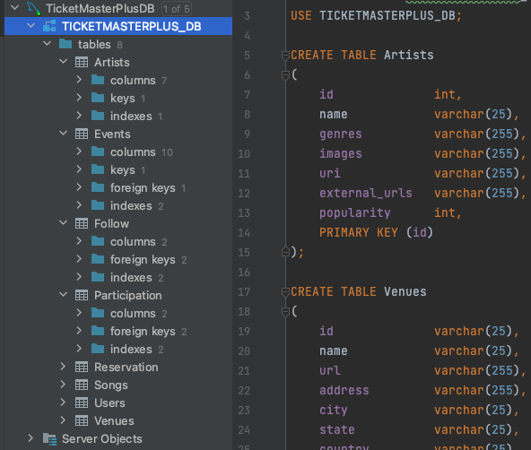
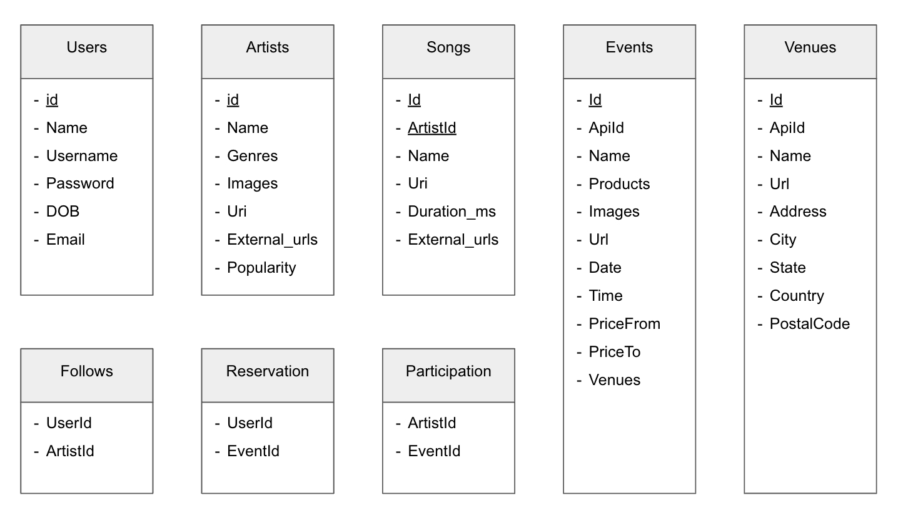

# AwesomeTicketMasterPlus

db_config = {

    "username" : "ticketmasterplus",
    
    "host": "database-1.cyc3xnhwrawo.us-east-1.rds.amazonaws.com",
    
    "port": "3306",
    
    "password": "Ticketplus123!"
    
}

Demo Video: https://drive.google.com/file/d/1Uocuy2FIpIzh_4JNYp0ou_uAb4z4HoP2/view?usp=share_link

Datasets: https://drive.google.com/drive/folders/13hBqT3HB0lJaQSMd7jMbm9xPDMFBLQsj?usp=share_link

API Documentation: https://docs.google.com/document/d/1sAm6Kv-MSEahjwk0TIwC0Ag5xMJYfVgCgsEFReK63Io/edit?usp=sharing

Web Setup:

      Step 1 -- install packages: 
                                      1. Open terminal and clone our GitHub repo:
                                      2. "git clone <our repo url>"
                                      3. In terminal window 1 "cd .../AwesomeTicketMasterPlus/client" 
                                      4. "npm install --force"
                                      5. In terminal window 2 "cd .../AwesomeTicketMasterPlus/server" 
                                      6. "npm install --force"
                                       
      Step 2 -- start frontend:  
                                      1. In terminal window 1, run following commands: 
                                      2. "npm start"
                                      
      Step 3 -- start backend:  
                                      1. In terminal window 2, run following commands:
                                      3. "npm start"
                               
      Step 4 -- testing the mini app:  
                                      1. open the browser in step 2 with url: "http://localhost:3000/"
                                      2. Start playing around this app to your hearts content! 
                                      3. There are following **notice points** for each features.
                                      

DB Name: 

    TICKETMASTERPLUS_DB

Tables:

    - Artists
    - Events
    - Venues
    - Songs
    - Users
    - Participation
    - Reservation
    - Follow

